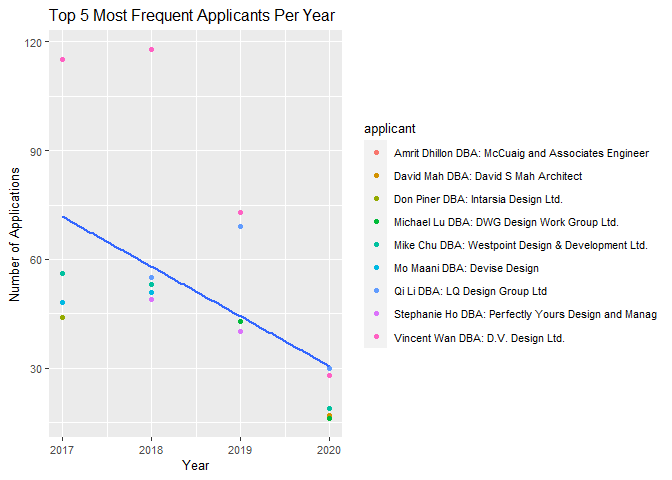
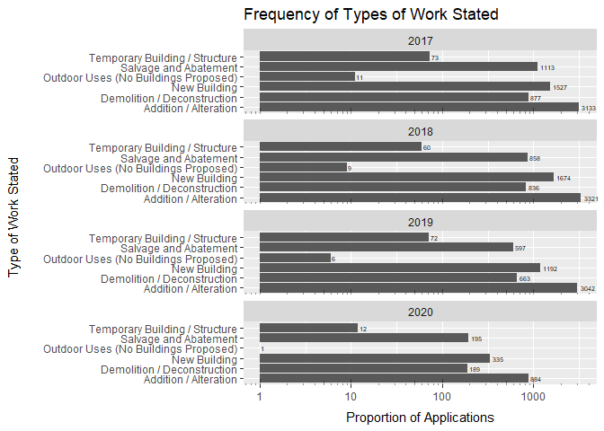
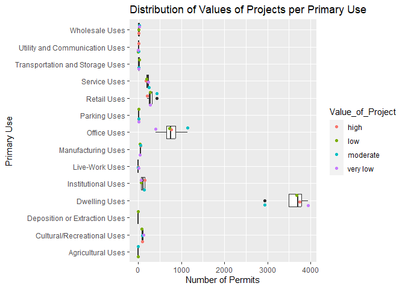
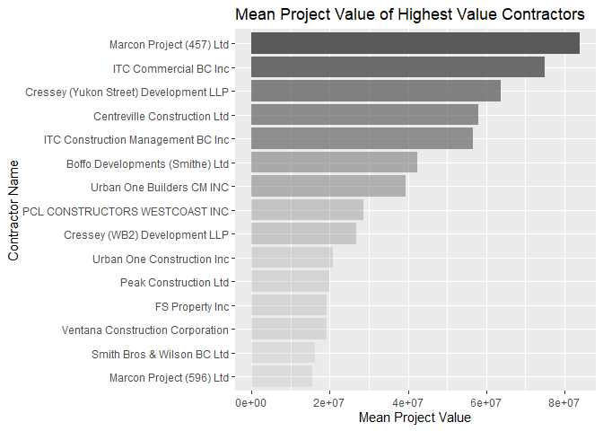

Mini Data Analysis Milestone 2
================

*To complete this milestone, you can either edit [this `.rmd`
file](https://raw.githubusercontent.com/UBC-STAT/stat545.stat.ubc.ca/master/content/mini-project/mini-project-2.Rmd)
directly. Fill in the sections that are commented out with
`<!--- start your work here--->`. When you are done, make sure to knit
to an `.md` file by changing the output in the YAML header to
`github_document`, before submitting a tagged release on canvas.*

# Welcome to the rest of your mini data analysis project!

In Milestone 1, you explored your data. and came up with research
questions. This time, we will finish up our mini data analysis and
obtain results for your data by:

- Making summary tables and graphs
- Manipulating special data types in R: factors and/or dates and times.
- Fitting a model object to your data, and extract a result.
- Reading and writing data as separate files.

We will also explore more in depth the concept of *tidy data.*

**NOTE**: The main purpose of the mini data analysis is to integrate
what you learn in class in an analysis. Although each milestone provides
a framework for you to conduct your analysis, it’s possible that you
might find the instructions too rigid for your data set. If this is the
case, you may deviate from the instructions – just make sure you’re
demonstrating a wide range of tools and techniques taught in this class.

# Instructions

**To complete this milestone**, edit [this very `.Rmd`
file](https://raw.githubusercontent.com/UBC-STAT/stat545.stat.ubc.ca/master/content/mini-project/mini-project-2.Rmd)
directly. Fill in the sections that are tagged with
`<!--- start your work here--->`.

**To submit this milestone**, make sure to knit this `.Rmd` file to an
`.md` file by changing the YAML output settings from
`output: html_document` to `output: github_document`. Commit and push
all of your work to your mini-analysis GitHub repository, and tag a
release on GitHub. Then, submit a link to your tagged release on canvas.

**Points**: This milestone is worth 50 points: 45 for your analysis, and
5 for overall reproducibility, cleanliness, and coherence of the Github
submission.

**Research Questions**: In Milestone 1, you chose two research questions
to focus on. Wherever realistic, your work in this milestone should
relate to these research questions whenever we ask for justification
behind your work. In the case that some tasks in this milestone don’t
align well with one of your research questions, feel free to discuss
your results in the context of a different research question.

# Learning Objectives

By the end of this milestone, you should:

- Understand what *tidy* data is, and how to create it using `tidyr`.
- Generate a reproducible and clear report using R Markdown.
- Manipulating special data types in R: factors and/or dates and times.
- Fitting a model object to your data, and extract a result.
- Reading and writing data as separate files.

# Setup

Begin by loading your data and the tidyverse package below:

``` r
library(datateachr) # <- might contain the data you picked!
library(tidyverse)
```

# Task 1: Process and summarize your data

From milestone 1, you should have an idea of the basic structure of your
dataset (e.g. number of rows and columns, class types, etc.). Here, we
will start investigating your data more in-depth using various data
manipulation functions.

### 1.1 (1 point)

First, write out the 4 research questions you defined in milestone 1
were. This will guide your work through milestone 2:

<!-------------------------- Start your work below ---------------------------->

1.  Within each year, which applicant(s) submitted the most building
    applications?
2.  What trends are there in the type of work stated for the permit
    applications over time?
3.  What is the relationship between the property use and project value?
4.  Which building contractors were listed on the permits for the
    highest value projects?

*Note: Question 2 was modified from my original question stated in MDA1.
This is so that I can look at a wider variety of variables to better
complete the required summarizing and graphing tasks for MDA2.*
<!----------------------------------------------------------------------------->

Here, we will investigate your data using various data manipulation and
graphing functions.

### 1.2 (8 points)

Now, for each of your four research questions, choose one task from
options 1-4 (summarizing), and one other task from 4-8 (graphing). You
should have 2 tasks done for each research question (8 total). Make sure
it makes sense to do them! (e.g. don’t use a numerical variables for a
task that needs a categorical variable.). Comment on why each task helps
(or doesn’t!) answer the corresponding research question.

Ensure that the output of each operation is printed!

Also make sure that you’re using dplyr and ggplot2 rather than base R.
Outside of this project, you may find that you prefer using base R
functions for certain tasks, and that’s just fine! But part of this
project is for you to practice the tools we learned in class, which is
dplyr and ggplot2.

**Summarizing:**

1.  Compute the *range*, *mean*, and *two other summary statistics* of
    **one numerical variable** across the groups of **one categorical
    variable** from your data.
2.  Compute the number of observations for at least one of your
    categorical variables. Do not use the function `table()`!
3.  Create a categorical variable with 3 or more groups from an existing
    numerical variable. You can use this new variable in the other
    tasks! *An example: age in years into “child, teen, adult, senior”.*
4.  Compute the proportion and counts in each category of one
    categorical variable across the groups of another categorical
    variable from your data. Do not use the function `table()`!

**Graphing:**

6.  Create a graph of your choosing, make one of the axes logarithmic,
    and format the axes labels so that they are “pretty” or easier to
    read.
7.  Make a graph where it makes sense to customize the alpha
    transparency.

Using variables and/or tables you made in one of the “Summarizing”
tasks:

8.  Create a graph that has at least two geom layers.
9.  Create 3 histograms, with each histogram having different sized
    bins. Pick the “best” one and explain why it is the best.

Make sure it’s clear what research question you are doing each operation
for!

<!------------------------- Start your work below ----------------------------->

# 1. Within each year, which applicant(s) submitted the most building applications?

## Summarizing: Compute the number of observations for at least one of your categorical variables.

I will count the number of applications for each applicant per year.
This will help answer my question by showing the number of applications
per applicant per year.

``` r
building_permits %>%
  group_by(year) %>%
  count(applicant) %>% #count number of applications per applicant
  arrange(year, desc(n)) #arrange tibble by year and by number of applications descending
```

    ## # A tibble: 8,377 × 3
    ## # Groups:   year [4]
    ##     year applicant                                              n
    ##    <dbl> <chr>                                              <int>
    ##  1  2017 Vincent Wan DBA: D.V. Design Ltd.                    115
    ##  2  2017 Michael Lu DBA: DWG Design Work Group Ltd.            56
    ##  3  2017 Mike Chu DBA: Westpoint Design & Development Ltd.     56
    ##  4  2017 Mo Maani DBA: Devise Design                           48
    ##  5  2017 Don Piner DBA: Intarsia Design Ltd.                   44
    ##  6  2017 TIMOTHY TSE DBA: Cadlab Design Inc.                   40
    ##  7  2017 Stephanie Ho DBA: Perfectly Yours Design and Manag    39
    ##  8  2017 Amardeep Dhillon DBA: Space Smart Home Design         38
    ##  9  2017 Qi Li DBA: LQ Design Group Ltd                        38
    ## 10  2017 Danny Lung DBA: Lung Designs Group Ltd.               37
    ## # ℹ 8,367 more rows

## Graphing: Create a graph that has at least two geom layers.

Based on my previous work, I will graph the top five applicants that
submitted the most applications each year to see which applicants
submitted the most building applications per year. I will also add a
trend line that shows the fit to a linear model to show the trend in
overall number of applications each year for the top 5 applicants.

``` r
building_permits %>%
  group_by(year) %>%
  count(applicant) %>%
  arrange(desc(n)) %>%
  slice(1:5) %>% #include only the top 5 applicants with the most applications per year
  ggplot(aes(x = year, y = n)) + 
  geom_point(aes(color = applicant)) + #make scatterplot showing number of applications per applicant per year
  geom_smooth(formula = y ~ x, method = lm, se= FALSE) + #use linear model to show trend over time in application number among yearly top 5 most frequent applicants
  theme(text = element_text(size = 10)) +
  ggtitle("Top 5 Most Frequent Applicants Per Year") +
  ylab("Number of Applications") +
  xlab("Year")
```

<!-- -->

# 2. What trends are there in the type of work stated for the permit applications over time?

## Summarizing: Compute the proportion and counts in each category of one categorical variable across the groups of another categorical variable from your data.

I will calculate the proportion and counts of each type of work per year
group. This will help me see how the proportions for each type of work
change over time.

``` r
building_permits %>%
  group_by(year, type_of_work) %>%
  summarise(n = n()) %>%
  mutate(proportion = n/sum(n)) #calculate proportion each type of work represents of the total types of work stated for each year
```

    ## `summarise()` has grouped output by 'year'. You can override using the
    ## `.groups` argument.

    ## # A tibble: 24 × 4
    ## # Groups:   year [4]
    ##     year type_of_work                             n proportion
    ##    <dbl> <chr>                                <int>      <dbl>
    ##  1  2017 Addition / Alteration                 3133    0.465  
    ##  2  2017 Demolition / Deconstruction            877    0.130  
    ##  3  2017 New Building                          1527    0.227  
    ##  4  2017 Outdoor Uses (No Buildings Proposed)    11    0.00163
    ##  5  2017 Salvage and Abatement                 1113    0.165  
    ##  6  2017 Temporary Building / Structure          73    0.0108 
    ##  7  2018 Addition / Alteration                 3321    0.491  
    ##  8  2018 Demolition / Deconstruction            836    0.124  
    ##  9  2018 New Building                          1674    0.248  
    ## 10  2018 Outdoor Uses (No Buildings Proposed)     9    0.00133
    ## # ℹ 14 more rows

## Create a graph of your choosing, make one of the axes logarithmic, and format the axes labels so that they are “pretty” or easier to read

I will make a bar graph with a logarithmic scale to illustrate how the
frequency of each type of work changes by year. This will illustrate the
changing trens in type of work stated dfor the permit applications over
time. However, a logarithmic scale may not have been the best axis to
use, since it may make the trends look visually skewed compared to the
reality. I attempted to emphasize the logarithmic scale using log ticks
to prevent such a misinterpretation. Additionally, I changed the
position of the axes labels to make them more legible.

``` r
building_permits %>%
  group_by(year, type_of_work) %>%
  summarise(n = n()) %>%
  ggplot(aes(y = type_of_work, x = n)) + 
  geom_col() +
  scale_x_continuous(trans = "log10") + #make x axis logarithmic
  annotation_logticks(sides = "b", 
                      alpha = 0.4,
                      short = unit(0.3,"mm"), mid = unit(1,"mm"), long = unit(1.5,"mm")) + #add log ticks and customize appearance 
  facet_wrap(~year, nrow = 4) + #make separate plots per year
  geom_text(aes(label = n), hjust = -0.2, size = 1.9) + #add count as labels to bars
  ylab("Type of Work Stated") +
  theme(axis.title.y = element_text(margin = margin(r = 20))) + #modify distance of y axis label from text
  xlab("Proportion of Applications") +
  theme(axis.title.x = element_text(margin = margin(t = 8))) + #modify distance of x axis label from text 
  ggtitle("Frequency of Types of Work Stated")
```

    ## `summarise()` has grouped output by 'year'. You can override using the
    ## `.groups` argument.

<!-- -->

# 3. What is the relationship between the property use and project value?

## Create a categorical variable with 3 or more groups from an existing numerical variable.

First, I want to check what values delineate each of the four quartiles.

``` r
building_permits %>%
  reframe(Quartiles = quantile(project_value, c(0.25, 0.5, 0.75), na.rm = TRUE))
```

    ## # A tibble: 3 × 1
    ##   Quartiles
    ##       <dbl>
    ## 1    10739 
    ## 2    48000 
    ## 3   217791.

Second, I want to create a new categorical variable named
Value_of_Project that groups the project_value variable into four groups
by quartile. The first group is named “very low”, the second is “low”,
the third is “moderate”, and the fourth is “high”.

``` r
building_permits %>%
  mutate(Value_of_Project = case_when(project_value < 10739 ~ "very low",
                                      10739 < project_value & project_value < 48000 ~ "low",
                                      48000 < project_value & project_value < 217791.2 ~ "moderate",
                                      TRUE ~ "high")) %>% #create new categorical variable with 4 groups
  relocate(Value_of_Project)
```

    ## # A tibble: 20,680 × 15
    ##    Value_of_Project permit_number issue_date project_value type_of_work  address
    ##    <chr>            <chr>         <date>             <dbl> <chr>         <chr>  
    ##  1 very low         BP-2016-02248 2017-02-01             0 Salvage and … 4378 W…
    ##  2 very low         BU468090      2017-02-01             0 New Building  1111 R…
    ##  3 low              DB-2016-04450 2017-02-01         35000 Addition / A… 3732 W…
    ##  4 low              DB-2017-00131 2017-02-01         15000 Addition / A… 88 W P…
    ##  5 moderate         DB452250      2017-02-01        181178 New Building  492 E …
    ##  6 very low         BP-2016-01458 2017-02-02             0 Salvage and … 3332 W…
    ##  7 low              BP-2016-02022 2017-02-02         15000 Demolition /… 2873 W…
    ##  8 very low         BP-2016-02424 2017-02-02             0 Salvage and … 3579 E…
    ##  9 high             BP-2016-02588 2017-02-02      65000000 New Building  620 CA…
    ## 10 low              BP-2016-03697 2017-02-02         25000 Addition / A… 1868 W…
    ## # ℹ 20,670 more rows
    ## # ℹ 9 more variables: project_description <chr>, building_contractor <chr>,
    ## #   building_contractor_address <chr>, applicant <chr>,
    ## #   applicant_address <chr>, property_use <chr>, specific_use_category <chr>,
    ## #   year <dbl>, bi_id <dbl>

## Create a graph that has at least two geom layers.

I will first separate the property_use variable into Primary_use,
Secondary_use, and Tertiary_use in order to tidy the data for this
question. I will be using the Primary_use as the basis for my graph and
analysis since it is the first listed property use. I will count the
number of observations of each primary use for each group of my
Value_of_Project variable and plot this. I will use a boxplot layer to
show the overall distribution over the Value_of_Project groups for each
primary use. I will use a jitter layer to show the counts for each of
the Value_of_Project groups.

``` r
suppressWarnings( #avoid printing warning
building_permits %>%
  separate(col = property_use,
           ",",
           into = c("Primary_use", "Secondary_use", "Tertiary_use", "Quaternary_Use", "Quinary_Use")) %>% #tidy property_use variable by separate multiple uses into primary, secondary, tertiary, quaternary, or quinary uses if multiple uses are listed
  mutate(Value_of_Project = case_when(project_value < 10739 ~ "very low",
                                      10739 < project_value & project_value < 48000 ~ "low",
                                      48000 < project_value & project_value < 217791.2 ~ "moderate",
                                      TRUE ~ "high")) %>%
  group_by(Value_of_Project, Primary_use) %>%
  drop_na(Primary_use) %>%
  count(Primary_use) %>%
  ggplot(aes(x = n, y = Primary_use)) +
  geom_boxplot() + #add a boxplot later to see overall distribution
  geom_jitter(aes(color = Value_of_Project)) + #add jitter layer to see individual counts per value of project category
  ylab("Primary Use") +
  xlab("Number of Permits") +
  labs(fill = "Value of Project") +
  ggtitle("Distribution of Values of Projects per Primary Use")
)
```

<!-- -->

# 4. Which building contractors were listed on the permits for the highest value projects?

## Compute the *range*, *mean*, and *two other summary statistics* of **one numerical variable** across the groups of **one categorical variable** from your data.

I will compute the range, mean, standard deviation, and median for the
project_value variable across the groups of the building_contractor
variable. This will allow me to get a better overall sense of the
project values for the various building contractors.

``` r
suppressWarnings(
building_permits %>%
  group_by(building_contractor) %>%
  drop_na(building_contractor) %>% #remove rows where building_contractor is missing
  summarise(Project_Value_Range = max(project_value, na.rm = TRUE) - min(project_value, na.rm = TRUE), #calculate range
             Project_Value_Mean = mean(project_value, na.rm = TRUE), #calculate mean
             Project_Value_Standard_Deviation = sd(project_value, na.rm = TRUE), #calculate standard deviation
             Project_Value_Median = median(project_value, na.rm = TRUE)) %>% #calculate median
  glimpse()
)
```

    ## Rows: 2,566
    ## Columns: 5
    ## $ building_contractor              <chr> "0373498 BC Ltd", "0686632 BC LTD.", …
    ## $ Project_Value_Range              <dbl> 0, 0, 1049763, 711750, 0, 0, 6800, 0,…
    ## $ Project_Value_Mean               <dbl> 6000.00, 588750.00, 579815.62, 564125…
    ## $ Project_Value_Standard_Deviation <dbl> NA, NA, 519774.244, 503283.252, NA, 0…
    ## $ Project_Value_Median             <dbl> 6000.0, 588750.0, 619750.0, 564125.0,…

## Make a graph where it makes sense to customize the alpha transparency.

I will graph the mean project value for eeach of the top 15 highest
value building contractors. I will use the alpha transparency (darker)
to emphasize the higher mean values since I am most interested in the
highest value projects.

``` r
building_permits %>%
  group_by(building_contractor) %>%
  drop_na(building_contractor) %>%
  mutate(Mean = mean(project_value, na.rm = TRUE)) %>% 
  ungroup() %>%
  arrange(desc(Mean)) %>%
  distinct(building_contractor, .keep_all = TRUE) %>%
  slice(1:15) %>%
  ggplot(aes(x = Mean, y = reorder(building_contractor, Mean), 
             alpha = Mean)) + #customize alpha by Mean project value to emphasize highest project values
  geom_col() +
  theme(legend.position = "none") +
  ylab("Contractor Name") +
  xlab("Mean Project Value") +
  ggtitle("Mean Project Value of Highest Value Contractors")
```

<!-- -->

<!----------------------------------------------------------------------------->

### 1.3 (2 points)

Based on the operations that you’ve completed, how much closer are you
to answering your research questions? Think about what aspects of your
research questions remain unclear. Can your research questions be
refined, now that you’ve investigated your data a bit more? Which
research questions are yielding interesting results?

<!------------------------- Write your answer here ---------------------------->

I am much closer to answering my questions. I think the exploration of
trends in work type over time yielded interesting results that I would
like to pursue more through modelling. I want to make predictions in
future trends in work type. Additionally, it was interesting to see the
differences in value of project based on the different types of work.
This question could be further refined to focus on the differences in
the range of different project values by work type.
<!----------------------------------------------------------------------------->

# Task 2: Tidy your data

In this task, we will do several exercises to reshape our data. The goal
here is to understand how to do this reshaping with the `tidyr` package.

A reminder of the definition of *tidy* data:

- Each row is an **observation**
- Each column is a **variable**
- Each cell is a **value**

### 2.1 (2 points)

Based on the definition above, can you identify if your data is tidy or
untidy? Go through all your columns, or if you have \>8 variables, just
pick 8, and explain whether the data is untidy or tidy.

<!--------------------------- Start your work below --------------------------->

``` r
building_permits %>%
  select(1:8) %>%
  glimpse()
```

    ## Rows: 20,680
    ## Columns: 8
    ## $ permit_number               <chr> "BP-2016-02248", "BU468090", "DB-2016-0445…
    ## $ issue_date                  <date> 2017-02-01, 2017-02-01, 2017-02-01, 2017-…
    ## $ project_value               <dbl> 0, 0, 35000, 15000, 181178, 0, 15000, 0, 6…
    ## $ type_of_work                <chr> "Salvage and Abatement", "New Building", "…
    ## $ address                     <chr> "4378 W 9TH AVENUE, Vancouver, BC V6R 2C7"…
    ## $ project_description         <chr> NA, NA, NA, NA, NA, NA, NA, NA, NA, NA, NA…
    ## $ building_contractor         <chr> NA, NA, NA, "Mercury Contracting Ltd", "08…
    ## $ building_contractor_address <chr> NA, NA, NA, "88 W PENDER ST  \r\nUnit 2069…

Based on the 8 selected variables (permit_number, issue_date,
project_value, type_of_work, address, project_description, building
contractor, and building_contractor_address), the data could be
considered tidy. Each variable is in its own column and each column is
one variable, each row is one observation, and each cell is one value
(although some values are described by multiple words). However, this
could depend on your analysis. For example, you could consider the issue
date to contain three variables (year-month-day), making the data
untidy, so in this case you could need to separate that column into 3 to
make it tidy (this is not the case for me).
<!----------------------------------------------------------------------------->

### 2.2 (4 points)

Now, if your data is tidy, untidy it! Then, tidy it back to it’s
original state.

If your data is untidy, then tidy it! Then, untidy it back to it’s
original state.

Be sure to explain your reasoning for this task. Show us the “before”
and “after”.

<!--------------------------- Start your work below --------------------------->

Since my data is tidy, I will first untidy it by uniting two columns, so
one column contains two variables and its cells contain two
measurements. Then, I will tidy it by separating those columns into two,
allowing each column to contain one variable and each cells to contain
one measurement.

``` r
building_permits %>%
  select(1:8) %>% #select 8 variables of tibble to show it is currently tidy
  glimpse()
```

    ## Rows: 20,680
    ## Columns: 8
    ## $ permit_number               <chr> "BP-2016-02248", "BU468090", "DB-2016-0445…
    ## $ issue_date                  <date> 2017-02-01, 2017-02-01, 2017-02-01, 2017-…
    ## $ project_value               <dbl> 0, 0, 35000, 15000, 181178, 0, 15000, 0, 6…
    ## $ type_of_work                <chr> "Salvage and Abatement", "New Building", "…
    ## $ address                     <chr> "4378 W 9TH AVENUE, Vancouver, BC V6R 2C7"…
    ## $ project_description         <chr> NA, NA, NA, NA, NA, NA, NA, NA, NA, NA, NA…
    ## $ building_contractor         <chr> NA, NA, NA, "Mercury Contracting Ltd", "08…
    ## $ building_contractor_address <chr> NA, NA, NA, "88 W PENDER ST  \r\nUnit 2069…

``` r
untidy_building_permits <- building_permits %>%
  unite("permit_number_and_date", permit_number:issue_date) %>% #untidy data by uniting permit_number and date variables into one column
  select(1:8)
glimpse(untidy_building_permits)
```

    ## Rows: 20,680
    ## Columns: 8
    ## $ permit_number_and_date      <chr> "BP-2016-02248_2017-02-01", "BU468090_2017…
    ## $ project_value               <dbl> 0, 0, 35000, 15000, 181178, 0, 15000, 0, 6…
    ## $ type_of_work                <chr> "Salvage and Abatement", "New Building", "…
    ## $ address                     <chr> "4378 W 9TH AVENUE, Vancouver, BC V6R 2C7"…
    ## $ project_description         <chr> NA, NA, NA, NA, NA, NA, NA, NA, NA, NA, NA…
    ## $ building_contractor         <chr> NA, NA, NA, "Mercury Contracting Ltd", "08…
    ## $ building_contractor_address <chr> NA, NA, NA, "88 W PENDER ST  \r\nUnit 2069…
    ## $ applicant                   <chr> "Raffaele & Associates DBA: Raffaele and A…

``` r
retidy_building_permits <- untidy_building_permits %>%
  separate(col = permit_number_and_date,
           "_",
           into = c("permit_number", "issue_date")) %>% #separate permit number and date variables to different columns to tidy data
  select(1:8)
glimpse(retidy_building_permits)
```

    ## Rows: 20,680
    ## Columns: 8
    ## $ permit_number               <chr> "BP-2016-02248", "BU468090", "DB-2016-0445…
    ## $ issue_date                  <chr> "2017-02-01", "2017-02-01", "2017-02-01", …
    ## $ project_value               <dbl> 0, 0, 35000, 15000, 181178, 0, 15000, 0, 6…
    ## $ type_of_work                <chr> "Salvage and Abatement", "New Building", "…
    ## $ address                     <chr> "4378 W 9TH AVENUE, Vancouver, BC V6R 2C7"…
    ## $ project_description         <chr> NA, NA, NA, NA, NA, NA, NA, NA, NA, NA, NA…
    ## $ building_contractor         <chr> NA, NA, NA, "Mercury Contracting Ltd", "08…
    ## $ building_contractor_address <chr> NA, NA, NA, "88 W PENDER ST  \r\nUnit 2069…

<!----------------------------------------------------------------------------->

### 2.3 (4 points)

Now, you should be more familiar with your data, and also have made
progress in answering your research questions. Based on your interest,
and your analyses, pick 2 of the 4 research questions to continue your
analysis in the remaining tasks:

<!-------------------------- Start your work below ---------------------------->

1.  What is the relationship between the property use and project value?
2.  Which building contractors were listed on the permits for the
    highest value projects?

<!----------------------------------------------------------------------------->

Explain your decision for choosing the above two research questions.

<!--------------------------- Start your work below --------------------------->

I chose these questions because I feel there is the most left to explore
in them. For question 1, my preliminary work showed me interesting
differences in the distribution of project value for the various
property uses, so I want to explore these trends further (as well as
discover new trends). For question 2, I have looked at basic summary
statistics relevant to the question, and looked at which contractors
were associated with the highest mean project values. However, I want to
further explore the relationship between contractor and permit value,
particularly with respect to time.
<!----------------------------------------------------------------------------->

Now, try to choose a version of your data that you think will be
appropriate to answer these 2 questions. Use between 4 and 8 functions
that we’ve covered so far (i.e. by filtering, cleaning, tidy’ing,
dropping irrelevant columns, etc.).

(If it makes more sense, then you can make/pick two versions of your
data, one for each research question.)

<!--------------------------- Start your work below --------------------------->

``` r
suppressWarnings( #avoid printing warning
building_permits %>%
  separate(col = property_use,
           ",",
           into = c("Primary_use", "Secondary_use", "Tertiary_use", "Quaternary_Use", "Quinary_Use")) %>% #tidy data so there is only one value per cell
  select(-c(permit_number, issue_date, type_of_work, applicant, applicant_address, address, project_description, bi_id)) %>% #drop irrelevant columns
  relocate(year) %>% #move year to first column
  group_by(year) %>%
  arrange(year, desc(project_value)) %>%
  glimpse()
)
```

    ## Rows: 20,680
    ## Columns: 10
    ## Groups: year [4]
    ## $ year                        <dbl> 2017, 2017, 2017, 2017, 2017, 2017, 2017, …
    ## $ project_value               <dbl> 91750000, 90000000, 80000000, 75000000, 65…
    ## $ building_contractor         <chr> "Wesgroup Contracting Ltd", "ITC Construct…
    ## $ building_contractor_address <chr> NA, "564 BEATTY ST  \r\nUnit 800\r\nVancou…
    ## $ Primary_use                 <chr> "Dwelling Uses", "Dwelling Uses", "Dwellin…
    ## $ Secondary_use               <chr> NA, "Office Uses", "Office Uses", "Parking…
    ## $ Tertiary_use                <chr> NA, "Parking Uses", "Retail Uses", "Retail…
    ## $ Quaternary_Use              <chr> NA, "Retail Uses", NA, "Service Uses", NA,…
    ## $ Quinary_Use                 <chr> NA, "Service Uses", NA, NA, NA, NA, NA, NA…
    ## $ specific_use_category       <chr> "Multiple Dwelling", "Financial Institutio…

# Task 3: Modelling

## 3.0 (no points)

Pick a research question from 1.2, and pick a variable of interest
(we’ll call it “Y”) that’s relevant to the research question. Indicate
these.

<!-------------------------- Start your work below ---------------------------->

**Research Question**: What trends are there in the type of work stated
for the permit applications over time?

**Variable of interest**: Proportion of work type that is for new
buildings

<!----------------------------------------------------------------------------->

## 3.1 (3 points)

Fit a model or run a hypothesis test that provides insight on this
variable with respect to the research question. Store the model object
as a variable, and print its output to screen. We’ll omit having to
justify your choice, because we don’t expect you to know about model
specifics in STAT 545.

- **Note**: It’s OK if you don’t know how these models/tests work. Here
  are some examples of things you can do here, but the sky’s the limit.

  - You could fit a model that makes predictions on Y using another
    variable, by using the `lm()` function.
  - You could test whether the mean of Y equals 0 using `t.test()`, or
    maybe the mean across two groups are different using `t.test()`, or
    maybe the mean across multiple groups are different using `anova()`
    (you may have to pivot your data for the latter two).
  - You could use `lm()` to test for significance of regression
    coefficients.

<!-------------------------- Start your work below ---------------------------->

# Fit a model

I will use the lm() function to fit my data to a linear model

``` r
NewBuilding_proportions <- building_permits %>%
  group_by(year, type_of_work) %>%
  summarise(n = n()) %>%
  mutate(proportion = n/sum(n)) %>%
  filter(type_of_work == "New Building") #calculate proportion of work type that is for new buildings by year
```

    ## `summarise()` has grouped output by 'year'. You can override using the
    ## `.groups` argument.

``` r
glimpse(NewBuilding_proportions) 
```

    ## Rows: 4
    ## Columns: 4
    ## Groups: year [4]
    ## $ year         <dbl> 2017, 2018, 2019, 2020
    ## $ type_of_work <chr> "New Building", "New Building", "New Building", "New Buil…
    ## $ n            <int> 1527, 1674, 1192, 335
    ## $ proportion   <dbl> 0.2267597, 0.2477064, 0.2139268, 0.2073020

``` r
BuildingProportions_lm <- lm(proportion ~ year, data = NewBuilding_proportions)
print(BuildingProportions_lm) #fit to linear model to examine proportions of work type for new buildings by year
```

    ## 
    ## Call:
    ## lm(formula = proportion ~ year, data = NewBuilding_proportions)
    ## 
    ## Coefficients:
    ## (Intercept)         year  
    ##   18.824984    -0.009215

<!----------------------------------------------------------------------------->

## 3.2 (3 points)

Produce something relevant from your fitted model: either predictions on
Y, or a single value like a regression coefficient or a p-value.

- Be sure to indicate in writing what you chose to produce.
- Your code should either output a tibble (in which case you should
  indicate the column that contains the thing you’re looking for), or
  the thing you’re looking for itself.
- Obtain your results using the `broom` package if possible. If your
  model is not compatible with the broom function you’re needing, then
  you can obtain your results by some other means, but first indicate
  which broom function is not compatible.

<!-------------------------- Start your work below ---------------------------->

``` r
library(broom) #load broom package
```

# Predicting Future Proportion of New Building Type of Work

Using the augment function, I will predict the proportion of type of
work that will be for new buildings from 2021-2025 based on my previous
linear model.

``` r
augment(BuildingProportions_lm, newdata = tibble(year = 2021:2025)) #make prediction about proportion of work type that is for New Buildings from year 2021-2025 
```

    ## # A tibble: 5 × 2
    ##    year .fitted
    ##   <int>   <dbl>
    ## 1  2021   0.201
    ## 2  2022   0.192
    ## 3  2023   0.182
    ## 4  2024   0.173
    ## 5  2025   0.164

<!----------------------------------------------------------------------------->

# Task 4: Reading and writing data

Get set up for this exercise by making a folder called `output` in the
top level of your project folder / repository. You’ll be saving things
there.

## 4.1 (3 points)

Take a summary table that you made from Task 1, and write it as a csv
file in your `output` folder. Use the `here::here()` function.

- **Robustness criteria**: You should be able to move your Mini Project
  repository / project folder to some other location on your computer,
  or move this very Rmd file to another location within your project
  repository / folder, and your code should still work.
- **Reproducibility criteria**: You should be able to delete the csv
  file, and remake it simply by knitting this Rmd file.

<!-------------------------- Start your work below ---------------------------->

``` r
library(here) #load here package
```

    ## here() starts at C:/Users/alexb/OneDrive/Documents/mda-abwang28

# Writing a Summary Table as a csv File

Using the here package, I will write my summary table as a csv file into
the Output folder.

``` r
work_type_trends <- building_permits %>%
  group_by(year, type_of_work) %>%
  summarise(n = n()) %>%
  mutate(proportion = n/sum(n)) #make summary table of count and proportion of work types by year and store in 'work_type_trends'
```

    ## `summarise()` has grouped output by 'year'. You can override using the
    ## `.groups` argument.

``` r
head(work_type_trends) 
```

    ## # A tibble: 6 × 4
    ## # Groups:   year [1]
    ##    year type_of_work                             n proportion
    ##   <dbl> <chr>                                <int>      <dbl>
    ## 1  2017 Addition / Alteration                 3133    0.465  
    ## 2  2017 Demolition / Deconstruction            877    0.130  
    ## 3  2017 New Building                          1527    0.227  
    ## 4  2017 Outdoor Uses (No Buildings Proposed)    11    0.00163
    ## 5  2017 Salvage and Abatement                 1113    0.165  
    ## 6  2017 Temporary Building / Structure          73    0.0108

``` r
write_csv(work_type_trends, 
          here("Output", "work_type_trends.csv")) #write table as csv file in Output folder
```

<!----------------------------------------------------------------------------->

## 4.2 (3 points)

Write your model object from Task 3 to an R binary file (an RDS), and
load it again. Be sure to save the binary file in your `output` folder.
Use the functions `saveRDS()` and `readRDS()`.

- The same robustness and reproducibility criteria as in 4.1 apply here.

<!-------------------------- Start your work below ---------------------------->

# Writing a model object to an R Binary File

``` r
saveRDS(BuildingProportions_lm, here("Output", "BuildingProportionsModel.RDS")) #save model as RDS
```

``` r
readRDS(here("Output", "BuildingProportionsModel.RDS")) #read RDS
```

    ## 
    ## Call:
    ## lm(formula = proportion ~ year, data = NewBuilding_proportions)
    ## 
    ## Coefficients:
    ## (Intercept)         year  
    ##   18.824984    -0.009215

<!----------------------------------------------------------------------------->

# Overall Reproducibility/Cleanliness/Coherence Checklist

Here are the criteria we’re looking for.

## Coherence (0.5 points)

The document should read sensibly from top to bottom, with no major
continuity errors.

The README file should still satisfy the criteria from the last
milestone, i.e. it has been updated to match the changes to the
repository made in this milestone.

## File and folder structure (1 points)

You should have at least three folders in the top level of your
repository: one for each milestone, and one output folder. If there are
any other folders, these are explained in the main README.

Each milestone document is contained in its respective folder, and
nowhere else.

Every level-1 folder (that is, the ones stored in the top level, like
“Milestone1” and “output”) has a `README` file, explaining in a sentence
or two what is in the folder, in plain language (it’s enough to say
something like “This folder contains the source for Milestone 1”).

## Output (1 point)

All output is recent and relevant:

- All Rmd files have been `knit`ted to their output md files.
- All knitted md files are viewable without errors on Github. Examples
  of errors: Missing plots, “Sorry about that, but we can’t show files
  that are this big right now” messages, error messages from broken R
  code
- All of these output files are up-to-date – that is, they haven’t
  fallen behind after the source (Rmd) files have been updated.
- There should be no relic output files. For example, if you were
  knitting an Rmd to html, but then changed the output to be only a
  markdown file, then the html file is a relic and should be deleted.

Our recommendation: delete all output files, and re-knit each
milestone’s Rmd file, so that everything is up to date and relevant.

## Tagged release (0.5 point)

You’ve tagged a release for Milestone 2.

### Attribution

Thanks to Victor Yuan for mostly putting this together.
